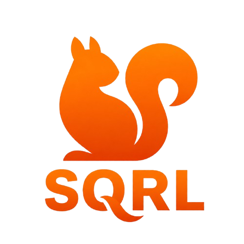
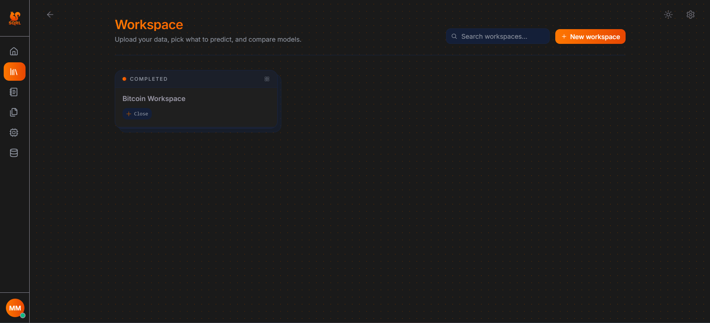
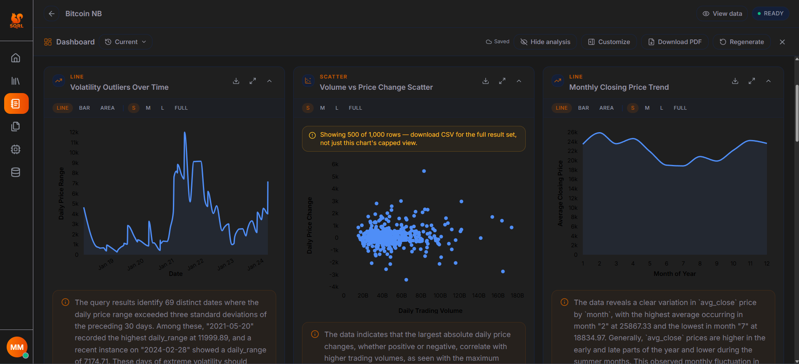
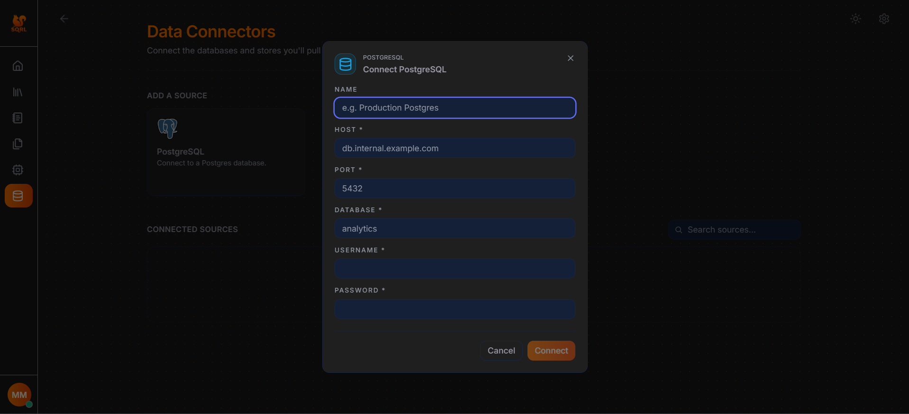
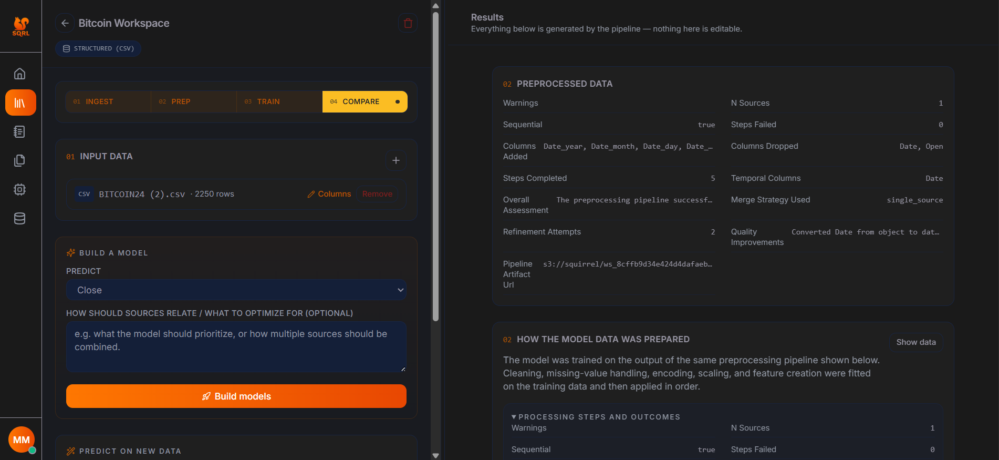
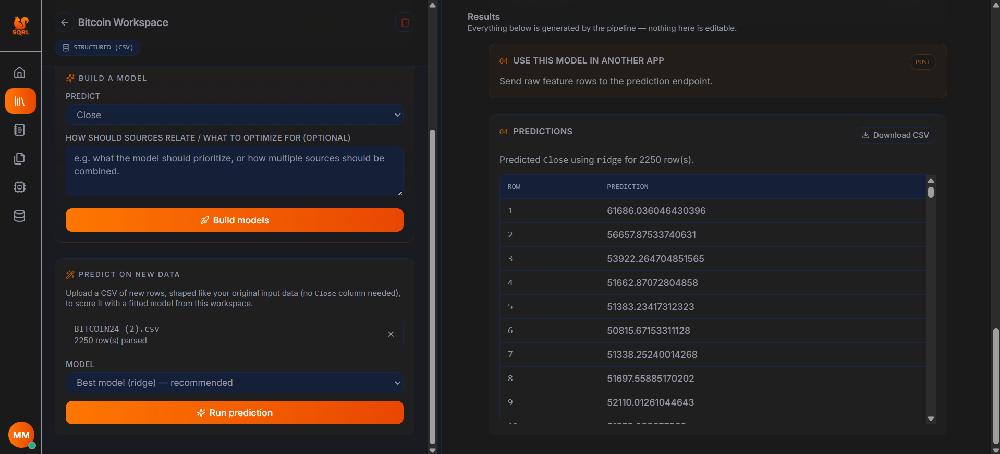
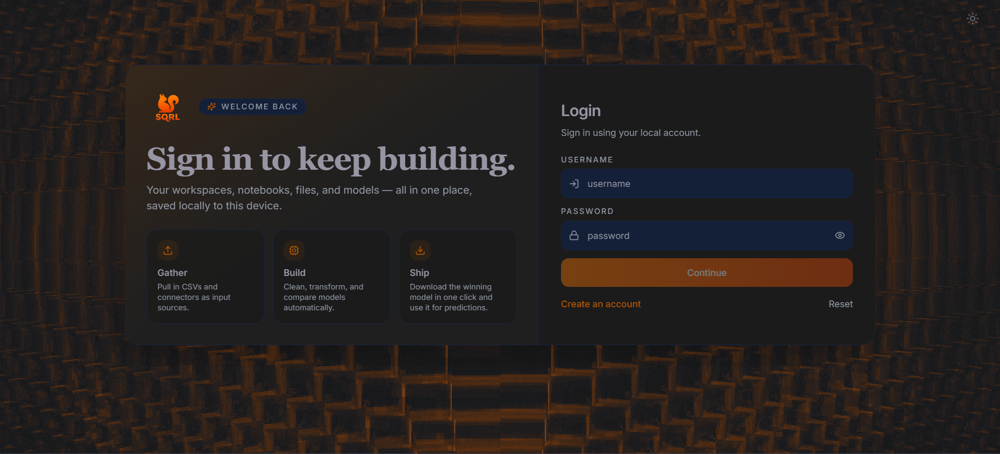

# SQRL

<div align="center">
  

  
  
  
  
</div>

Squirrel is a full-stack application for analyzing, preparing, building machine learning models, and serving predictions.

## Features

SQRL brings the complete machine-learning workflow into one workspace:

### 1. Workspace Page

Create and manage isolated workspaces for each project. Upload CSV files or
connect PostgreSQL sources, inspect datasets, choose a target column, and start
the modeling workflow from one place.



### 2. Notebook Page

Explore data through an interactive notebook experience. Review dataset
summaries, generated analysis, and recommendations while keeping the work
associated with its workspace.



### 3. Data Connection Page

Configure reusable data connections for external sources. SQRL supports
PostgreSQL connectors alongside uploaded files, allowing data to be prepared
and reused without repeatedly importing the same source.



### 4. Model Training and Comparison

Train multiple machine-learning models, compare their evaluation metrics, and
select the recommended model for a workspace. Fitted preprocessing pipelines
and model artifacts are retained for later predictions.



### 5. Predictions and External API

Submit new CSV rows to generate predictions with a completed workspace model.
The external prediction endpoint lets other applications use trained models 
through authenticated API requests.



### 6. Authentication and Storage

Protect workspaces with user authentication while PostgreSQL stores application
metadata and MinIO stores uploaded files, processed datasets, pipelines, and
model artifacts.



## Architecture

```text
Browser
	|
	| http://localhost:8000
	v
sqrl container
	|- FastAPI API: /api/*
	|- Compiled React SPA: /*
	|
	+--> PostgreSQL: application records and workspace metadata
	+--> MinIO: files, processed CSVs, pipelines, and models
```

The root `Dockerfile` uses a multi-stage build:

1. Node builds `frontend/dist`.
2. Python installs backend dependencies.
3. FastAPI serves the compiled frontend and API from the same container.

## Requirements

For Docker deployment:

- Docker Desktop with Compose support

For local development:

- Python 3.10 or newer
- Node.js 20 or newer
- npm
- PostgreSQL and MinIO, unless using the Compose services

## Docker Quick Start

Create a local environment file if one does not exist:

```powershell
Copy-Item .env.example .env
```

Add the required provider credentials to `.env`. Do not commit `.env` or real API keys.

Start the stack from the repository root:

```powershell
docker compose up --build -d
```

Open the application at:

```text
http://localhost:8000
```

Useful service URLs:

| Service | URL |
| --- | --- |
| Squirrel | http://localhost:8000 |
| API docs | http://localhost:8000/docs |
| PostgreSQL | http://localhost:5433 |
| MinIO API | http://localhost:9000 |
| MinIO console | http://localhost:9001 |
| pgAdmin | http://localhost:5050 |

View application logs:

```powershell
docker compose logs -f sqrl
```

Stop the stack:

```powershell
docker compose down
```

Stop the stack and delete database/object-storage volumes:

```powershell
docker compose down -v
```

The last command permanently removes local PostgreSQL and MinIO data.

## Environment Configuration

The backend reads settings from `.env` through Docker Compose. Start with `.env.example` and configure at least the provider keys required by the agents you plan to use.

Common variables:

| Variable | Purpose |
| --- | --- |
| `ENVIRONMENT` | Runtime environment, such as `development` or `production` |
| `LOG_LEVEL` | Backend logging level |
| `DATABASE_URL` | Optional database connection override |
| `MINIO_ENDPOINT` | MinIO endpoint used by the backend |
| `MINIO_BUCKET` | Object-storage bucket name |
| `MINIO_ACCESS_KEY` | MinIO access key |
| `MINIO_SECRET_KEY` | MinIO secret key |
| `GEMINI_API_KEY_V1` | Gemini provider credential |
| `GROQ_API_KEY_V1` | Groq provider credential |
| `OPENROUTER_API_KEY_V1` | OpenRouter provider credential |

For the single-container deployment, the frontend uses the relative API base `/api`. This allows the browser to call the backend through the same origin and avoids hard-coded container or host addresses.

## Application Workflow

1. Register or log in at `/signup` or `/login`.
2. Create a workspace at `/workspace`.
3. Upload CSV files or attach a configured PostgreSQL connector.
4. Choose the target column and optionally describe how sources should relate.
5. Build models.
6. Review preprocessing steps, transformed data, model metrics, and recommendations.
7. Use the prediction form to score new CSV rows.
8. Use the external API panel to call the trained model from another application.

## Prediction API

All protected API requests require a bearer token obtained from `/api/auth/login` or `/api/auth/register`.

Register:

```http
POST http://localhost:8000/api/auth/register
Content-Type: application/json
```

```json
{
	"username": "analyst",
	"email": "analyst@example.com",
	"password": "replace-with-a-strong-password",
	"full_name": "Data Analyst"
}
```

Predict with a completed workspace:

```http
POST http://localhost:8000/api/workspace/{workspace_id}/api/predict
Authorization: Bearer <access_token>
Content-Type: application/json
```

```json
{
	"rows": [
		{
			"age": 42,
			"income": 72000,
			"region": "north"
		}
	],
	"model_key": "random_forest"
}
```

Omit `model_key` to use the workspace's recommended model. The rows must contain the raw feature names expected by the workspace. The backend replays the fitted preprocessing pipeline before running the model.

The original authenticated route is also available:

```text
POST /api/workspace/{workspace_id}/predict
```

## Local Development

### Backend

```powershell
Push-Location backend
python -m venv .venv
\.venv\Scripts\Activate.ps1
pip install -r requirements.txt
uvicorn main:app --reload --host 0.0.0.0 --port 8000
Pop-Location
```

### Frontend

```powershell
Push-Location frontend
npm install
npm run dev
Pop-Location
```

The frontend development server runs at `http://localhost:8080`. Set `VITE_BACKEND_API_BASE_URL` in a local frontend environment file when the backend is not available at the default relative `/api` path:

```text
VITE_BACKEND_API_BASE_URL=http://localhost:8000/api
```

Useful frontend commands:

```powershell
npm run build
npm run lint
```

## Project Layout

```text
.
|- Dockerfile                 # Combined frontend/backend production image
|- docker-compose.yml         # Application, PostgreSQL, MinIO, and pgAdmin
|- backend/
|  |- main.py                 # FastAPI application entry point
|  |- squirrel/api/           # API routers
|  |- squirrel/services/      # Workspace, storage, auth, and connector services
|  |- squirrel/modules/       # Inspectors, preprocessors, agents, and providers
|  |- squirrel/schemas/       # API and domain schemas
|  `- requirements.txt
|- frontend/
|  |- src/                    # React application
|  |- public/imgs/            # Public image assets served at /imgs/*
|  `- package.json
`- .env.example
```